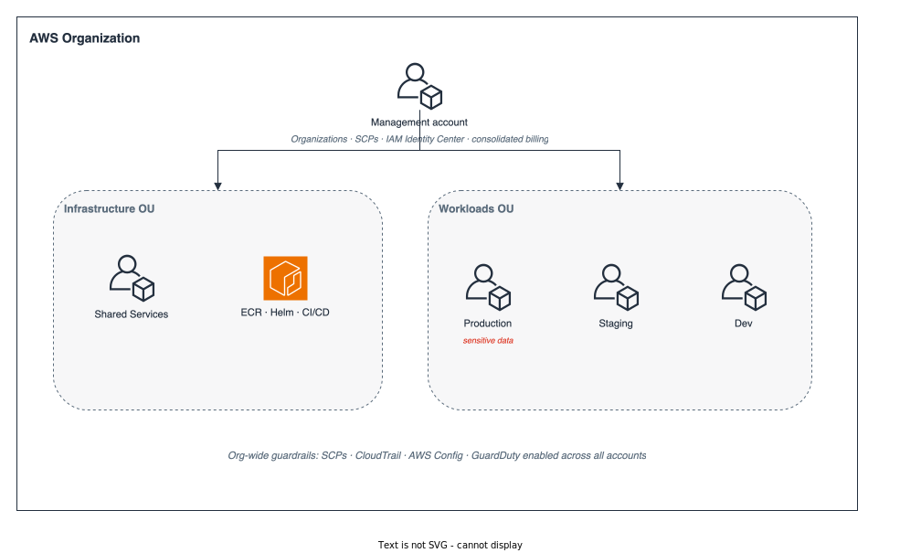
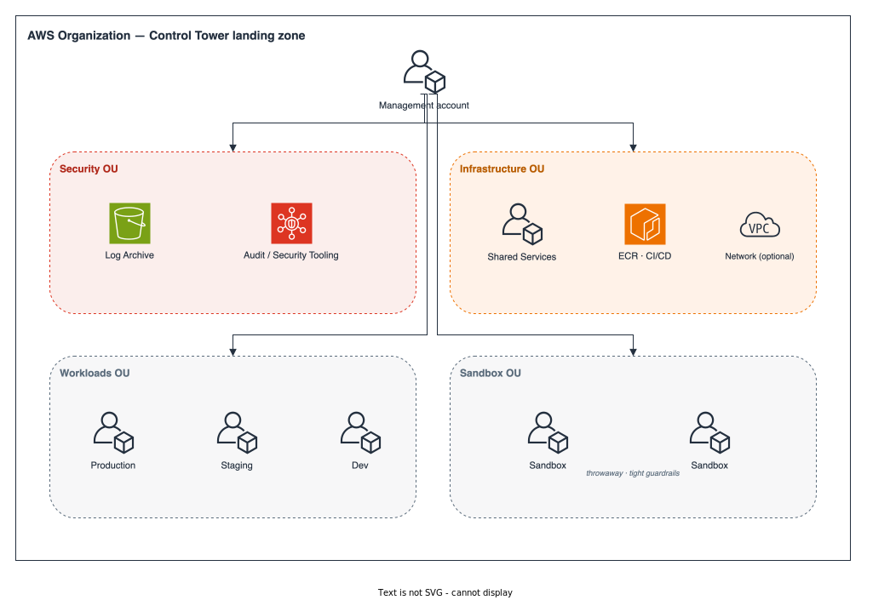

[← Index](README.md) · **Cloud Environment** · [Network Design →](02-network-design.md)

# 1. Cloud Environment Structure

The account topology is the outermost security and billing boundary. Account boundaries are **cheap to create now but expensive to add later** — moving live resources between accounts is real migration work. So we set up the boundaries that matter up front (per-environment isolation and a shared-services account) and defer only the accounts we can safely do without for now.

## Phase 1 — one account per environment, plus shared services

We create an **AWS Organization** with a workload-free management account and member accounts grouped into Organizational Units (OUs). Using Organizations and OUs from day one (rather than one flat account) makes the later expansion a reorganization, not a rebuild.

- **Management account** — owns AWS Organizations, consolidated billing, and Service Control Policies (SCPs). It runs **IAM Identity Center (SSO)** for all human access and **hosts no workloads**, keeping the most privileged account small and quiet.
- **Shared Services account** — the platform's shared supply chain: the **ECR** registry for container images, the **Helm/OCI chart** registry, and the **CI/CD** tooling. Every environment pulls images and charts from here, so artifacts are built and scanned once and promoted across environments rather than rebuilt per account.
- **Production account** — the only place sensitive user data lives. Its own account gives the strongest available blast-radius boundary: a mistake in dev or staging cannot reach production data or credentials.
- **Staging and Dev accounts** — a dedicated account each, from the start. They cost nothing extra to stand up now, and giving each environment its own account avoids a painful resource migration the day we need staging to faithfully mirror production.

**Cost lever (only if budget is a hard constraint).** Dev and staging can instead be collapsed into a single non-prod account running one namespace-isolated EKS cluster, trimming both account overhead and a Kubernetes control plane. We still recommend the per-environment split above: a shared dev/staging cluster saves money now but is eventually forced apart anyway — to scale cleanly and to let separate teams develop in parallel without resource contention or blast-radius bleed.

Even in Phase 1 we enable the controls that are cheap and painful to retrofit:

- **Org-wide guardrails via SCPs** — restrict usable regions, deny disabling of CloudTrail/Config/GuardDuty, and block root-user actions.
- **Org-wide audit baseline** — organization CloudTrail, AWS Config, and GuardDuty enabled across all accounts. Logs are centralized later (see Target state); the *recording* starts now.
- **Federated, least-privilege human access** — no long-lived IAM users; engineers assume role-based permission sets through IAM Identity Center.

## Target state — Control Tower landing zone

As traffic, team size, and compliance obligations grow, we adopt an **AWS Control Tower** landing zone. The workload and shared-services accounts already exist from Phase 1; the target state mainly adds the **Security OU** and a **Sandbox OU**:

Key changes from Phase 1: a dedicated **Log Archive** account holds immutable audit logs; a **Security Tooling** account becomes the delegated administrator for GuardDuty and Security Hub; and a **Sandbox OU** gives engineers throwaway accounts with tight guardrails. Workload VPCs remain **per-environment** — we only introduce an optional **Network account** (central NAT egress and shared private DNS) if account growth makes per-account NAT gateways the dominant network cost.

## Cost governance

Cost discipline is built into the account model rather than bolted on later:

- **Mandatory tagging** via Organizations **Tag Policies**, backed by SCPs that deny resource creation without the required tags (`environment`, `owner`, `cost-center`, `app`). Every dollar is attributable to a team and an environment.
- **AWS Budgets per account** with alert thresholds, plus **Cost Anomaly Detection**, routed to the team's chat so surprises surface in hours, not at month close.
- **Consolidated billing** in the management account yields one bill and volume discounts; **Cost Explorer** breaks spend down by account/environment/tag.

## Trade-offs

| Decision (Phase 1)                          | We gain                                       | We give up / mitigation                                                                                      |
| ------------------------------------------- | --------------------------------------------- | ------------------------------------------------------------------------------------------------------------ |
| One account per environment up front        | No cross-account resource migration later     | A few more accounts to baseline now. *Mitigated:* accounts are free and provisioned as code; cost is one-time.|
| Per-environment VPCs, no central networking | Far simpler topology for a self-contained app | No shared egress/DNS yet. *Mitigated:* added later via an optional Network account only if it pays for itself.|
| No dedicated Log Archive / Security account | Simpler start, fewer moving parts             | Audit logs not yet immutable/centralized. *Mitigated:* org CloudTrail/Config/GuardDuty record from day 1.    |
| Manual Organization vs. Control Tower       | No landing-zone constraints early             | Some governance is hand-rolled. *Mitigated:* OU layout matches Control Tower, so adoption is non-disruptive. |

The single most important property: because we start with **Organizations + OUs + IAM Identity Center + org-wide logging**, every Phase 1 account can be *moved* into the target OU structure and enrolled into Control Tower without recreating workloads. Phase 1 is a strict subset of the target state, never a detour.

---

[← Index](README.md) · **Cloud Environment** · [Network Design →](02-network-design.md)
