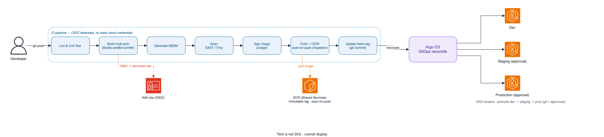

[← Network Design](02-network-design.md) · [Index](README.md) · [Database →](04-database.md)

# 3. Compute Platform

The application runs on **Amazon EKS**. AWS runs the control plane across three AZs; we own the worker nodes, the add-ons, and the delivery pipeline. The goal is a cluster that's cheap while traffic is low and scales to much higher load through configuration, not redesign.

## Cluster topology

**One EKS cluster per environment**, each in its own account ([Cloud Environment](01-cloud-environment.md)) and VPC ([Network Design](02-network-design.md)), running Kubernetes **1.36** as pinned in [`live/dev/env.hcl`](../terraform/live/dev/env.hcl). Separate clusters — rather than namespace-based multi-tenancy in one cluster — give production a hard isolation boundary, which matters for sensitive data, and let non-prod upgrade Kubernetes ahead of prod to de-risk version bumps.

Core capabilities are installed as **EKS-managed add-ons** (VPC CNI, CoreDNS, kube-proxy) plus a small, declaratively-managed platform layer: **Karpenter** (node autoscaling), the **AWS Load Balancer Controller**, the **ingress controller** ([Network Design](02-network-design.md)), **ExternalDNS**, the **External Secrets Operator** (syncing secrets from AWS Secrets Manager into the cluster), and **metrics-server**. TLS certificates are issued by **ACM and terminated at the ALB**, so no in-cluster certificate manager is needed. Pods receive AWS permissions through **EKS Pod Identity** where supported; the Karpenter controller on Fargate uses **IRSA** because Pod Identity is not available there.

## Node strategy, scaling, and resource allocation

The cluster bootstraps with **no pre-provisioned nodes**:

- **Fargate runs the bootstrap controllers.** Karpenter and CoreDNS run on **AWS Fargate** (kube-system), so there is no chicken-and-egg dependency on a node group and no idle baseline nodes to pay for.
- **Karpenter runs everything else.** Once Karpenter is up, it provisions nodes on demand to fit pending pods and consolidates (bin-packs and removes idle nodes) as load drops — faster and cheaper than a static node group plus Cluster Autoscaler.

A **single default Karpenter NodePool** keeps the platform simple while delivering the price/performance the company asked for:

- **Architectures:** both `arm64` (Graviton) and `amd64` (x86) are allowed; the pool **prefers Graviton + Spot** and falls back to on-demand when Spot is unavailable.
- **Capacity:** Spot for general workloads, on-demand as fallback; a **diversified set of instance types** so the Spot pool is deep enough to avoid mass interruptions.
- **Consolidation** is enabled so the cluster continuously shrinks to the cheapest layout that still fits the pods.

Workloads pick where they land with standard Kubernetes scheduling — a `nodeSelector` on `kubernetes.io/arch` (`arm64` or `amd64`) and tolerations for Spot — which is exactly the developer experience demonstrated in the `terraform/` README.

Scaling works at three levels, and resource hygiene keeps it predictable:

- **Pods:** the Horizontal Pod Autoscaler scales replicas on CPU / custom metrics (KEDA for event-driven scaling at target state).
- **Nodes:** Karpenter scales the node count to match pending pods.
- **Right-sizing:** every pod sets **requests and limits**; namespaces enforce **ResourceQuotas** and **LimitRanges**; **PodDisruptionBudgets** protect availability during consolidation and upgrades; **topology spread** keeps replicas across AZs; and **PriorityClasses** ensure system/critical pods win under contention. Karpenter drains nodes gracefully on Spot interruption notices.

## Containerization and delivery

Build, registry, and deployment form one tracked path from commit to cluster:

- **Build.** Multi-stage Dockerfiles on minimal/distroless bases, running as a non-root user. Images are built **multi-arch (`amd64` + `arm64`)** with Buildx so the *same* tag runs on either x86 or Graviton — the prerequisite for the Graviton-first node pool above. A genuine SBOM is produced per build.
- **Registry.** **Amazon ECR in the Shared Services account**, pulled cross-account by every environment. Repositories use **immutable tags** (the git SHA), **scan-on-push** (Inspector), and lifecycle policies to expire old images. Images are **signed (cosign)**; admission policy verifies signatures at target state.
- **Pipeline identity.** CI authenticates to AWS via **OIDC federation** (the CI provider's identity token exchanged for a short-lived IAM role), so there are **no static cloud credentials** to store, leak, or rotate.
- **Deploy.** CI builds, tests, scans, pushes, and updates the chart's image tag; a **GitOps controller (Argo CD)** then reconciles the declared state into each cluster. Git is the single source of truth, which gives auditable, revertible deploys and drift detection — a good fit for a sensitive-data environment. Promotion flows dev → staging → prod through git with approvals. Rollouts are plain rolling updates in Phase 1.
- **Ephemeral preview environments.** An Argo CD **ApplicationSet PR generator** spins up a per-PR environment — its own namespace plus a throwaway CloudNativePG database ([Database](04-database.md)) — and tears it down on merge or close, so reviewers test real deployments without touching shared environments.

## Target state

- **Progressive delivery** — **Argo Rollouts layered on Argo CD** for canary and blue/green, replacing plain rolling updates once traffic justifies the safety.
- **Event-driven scaling** with KEDA, and a **service mesh** for mTLS and richer L7 traffic control ([Network Design](02-network-design.md)).
- **Policy-as-code admission** (Kyverno / OPA Gatekeeper) enforcing signed images, non-root, resource limits, and approved registries cluster-wide.
- **Multi-region clusters** with the same GitOps pipeline targeting both regions.

## Trade-offs

| Decision (Phase 1)                          | We gain                                          | We give up / mitigation                                                                                  |
| ------------------------------------------- | ------------------------------------------------ | -------------------------------------------------------------------------------------------------------- |
| One cluster per environment                 | Hard isolation for the sensitive prod tier       | More control planes to pay for and patch. *Mitigated:* control-plane cost is small and clusters are IaC; non-prod can collapse to one cluster if budget demands ([Cloud Environment](01-cloud-environment.md)). |
| Spot for general workloads                  | Large compute savings                            | Spot interruptions. *Mitigated:* diversified types, on-demand fallback, PDBs, stateless app, graceful drain.|
| Graviton-first node pool                    | Best price/performance                           | Requires arm64 images. *Mitigated:* multi-arch builds; the x86 pool remains available for any exception. |
| Single Karpenter NodePool                   | One simple thing to reason about                 | Less fine-grained partitioning. *Mitigated:* scheduling constraints split workloads; add pools when needed.|
| GitOps + rolling updates (no canary yet)    | Auditable deploys without extra moving parts     | No automated canary analysis yet. *Mitigated:* Argo Rollouts is an additive upgrade, not a migration.    |

The compute layer scales by **configuration, not redesign**: growth means wider Spot diversification, more replicas, canary rollouts, and eventually a second region — all on the same cluster topology and the same pipeline.

---

[← Network Design](02-network-design.md) · [Index](README.md) · [Database →](04-database.md)
