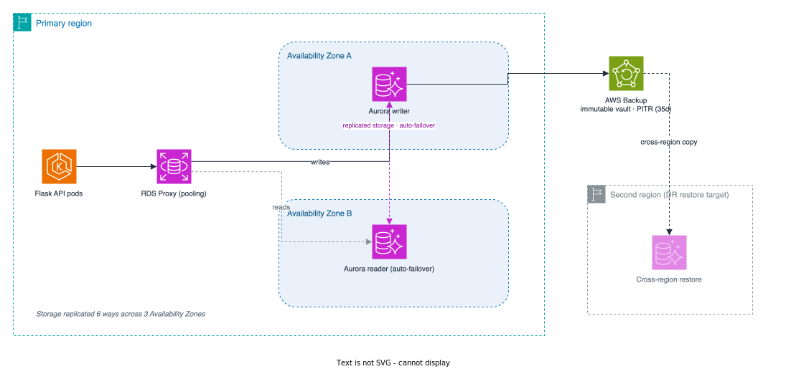

[← Compute Platform](03-compute-platform.md) · [Index](README.md) · [Observability & Operations →](05-observability.md)

# 4. Database

PostgreSQL holds the sensitive system of record, so we run it as a **managed service** rather than on EC2 or in the cluster. That takes patching, failover, and backups off our plate, and gives us encryption, HA, and point-in-time recovery as configuration.

## Recommendation — Aurora PostgreSQL of record, right-sized per environment

Production runs on **Aurora PostgreSQL**. It's wire-compatible with PostgreSQL (no app or tooling changes) and fits the project's theme of **scaling by configuration, not migration**: Serverless v2 scales compute with demand, storage grows on its own, up to **15 read replicas** offload reads, and **Aurora Global Database** adds multi-region later — all without changing engines. Under the hood, storage is replicated **six ways across three AZs**.

We don't pay for production-grade resilience in every environment. Each tier runs the cheapest option that still gives enough fidelity:

| Environment                         | Database                                            | Resilience      | Why                                                         |
| ----------------------------------- | --------------------------------------------------- | --------------- | ----------------------------------------------------------- |
| Ephemeral (feature branch / local)  | In-cluster PostgreSQL via the **CloudNativePG** operator (Helm) | Disposable | Zero managed cost; spins up and tears down with the branch  |
| Dev                                 | Single **RDS for PostgreSQL** (Single-AZ)           | Single-AZ       | Cheap, persistent shared dev data; no HA needed             |
| Staging                             | **Single-instance Aurora** (no Multi-AZ)            | Single instance | Engine-parity with prod at minimal cost                     |
| Production                          | **Aurora PostgreSQL, Multi-AZ** (writer + reader in separate AZs) | Multi-AZ HA | Real HA and a fast path to read replicas / Global Database  |

Staging runs the same engine as prod (Aurora) but without Multi-AZ. That gives realistic testing of migrations and queries without paying for a second AZ; the one thing it can't rehearse is failover, which is an acceptable gap. Ephemeral environments use CloudNativePG, so a feature branch gets a throwaway in-cluster database with no cloud spend and no provisioning wait.

## Production — HA, backups, and disaster recovery

All managed databases live in the data-tier subnets from [Network Design](02-network-design.md) — no internet route either way, reachable only from the app-tier security group on port 5432.

- **High availability.** Production runs an Aurora writer plus a reader in a **different AZ**. On failure, Aurora promotes the reader automatically (usually ~30s), and six-way storage replication means an AZ loss costs no data.
- **Connection management.** Pods connect through **Amazon RDS Proxy**, which pools connections and fails over transparently. This matters once many Karpenter-scaled pods would otherwise blow through Postgres connection limits — a classic scaling failure. (PgBouncer plays the same role for the CloudNativePG environments.)
- **Backups.** Continuous backup to S3 gives **point-in-time recovery** to any second in the retention window (35 days in prod, shorter in dev/staging), on top of daily snapshots. Backups are **KMS-encrypted**, and **AWS Backup** copies production backups into a separate **Vault-Lock immutable** vault to guard against accidental deletion and ransomware. Ephemeral databases aren't backed up, by design.
- **Disaster recovery.** Production backups are **copied to a second region** for cross-region point-in-time restore. Targets at this stage: **RPO of minutes, RTO of a couple of hours** (provision + restore) — fine while the business is small. We **drill the restore on a schedule** so the RPO/RTO are proven, not assumed (see [Observability & Operations](05-observability.md)).
- **Sensitive-data handling.** Encryption at rest with a **customer-managed KMS key**; **TLS enforced** in transit (`rds.force_ssl`); credentials in **Secrets Manager with automatic rotation**, delivered to pods via the External Secrets Operator ([Compute Platform](03-compute-platform.md)). `pgAudit` logs are forwarded into **VictoriaLogs** for querying ([Observability & Operations](05-observability.md)), with the Log Archive account holding the immutable audit copy.

## Target state

- **Aurora Global Database** for true multi-region DR: sub-second cross-region replication tightens DR to **RPO ~1s and RTO ~1 minute** via managed secondary promotion — paired with the multi-region clusters from [Network Design](02-network-design.md) and [Compute Platform](03-compute-platform.md).
- **Read replicas scaled out** behind a reader endpoint as read traffic grows, with the app routing reads and writes to separate endpoints.
- **IAM database authentication** to drop long-lived passwords where supported.

## Trade-offs

| Decision (Phase 1)                          | We gain                                       | We give up / mitigation                                                                                  |
| ------------------------------------------- | --------------------------------------------- | -------------------------------------------------------------------------------------------------------- |
| Resilience tiered per environment           | Pay for HA only where it matters              | Lower envs aren't prod-identical. *Mitigated:* staging keeps Aurora engine-parity; ephemeral is disposable.|
| CloudNativePG for ephemeral envs            | Throwaway DBs with zero cloud spend           | A second Postgres flavor to know. *Mitigated:* confined to disposable envs; the prod path is pure Aurora.|
| Staging single-instance (no Multi-AZ)       | Realistic engine testing at low cost          | Failover isn't rehearsed in staging. *Mitigated:* HA is a config flip; prod runs Multi-AZ.               |
| Production single-region, Multi-AZ          | Strong AZ resilience at low cost              | Region loss means a restore, not instant failover. *Mitigated:* cross-region backup copy now; Global Database at target. |

Like the rest of the platform, the database **grows by turning configuration knobs** — more ACUs, more read replicas, then a Global Database — never by re-platforming.

---

[← Compute Platform](03-compute-platform.md) · [Index](README.md) · [Observability & Operations →](05-observability.md)
