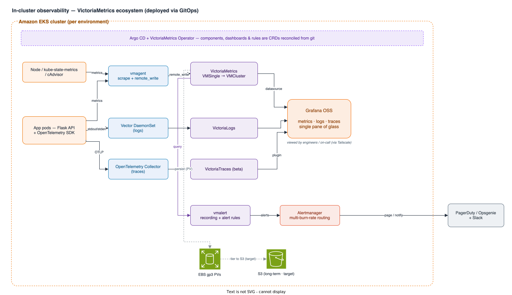

[← Database](04-database.md) · [Index](README.md)

# 5. Observability & Operations (cross-cutting)

For a sensitive-data system, how fast you notice and recover from problems matters as much as how it's built. This applies to every layer above, so it's covered once here. The approach: **golden signals first, everything as code, and prove recovery instead of assuming it.**

Observability is the one place we deliberately run **self-hosted instead of managed**. The stack is the **[VictoriaMetrics](https://docs.victoriametrics.com/victoriametrics/) ecosystem — VictoriaMetrics, VictoriaLogs, and VictoriaTraces — running in-cluster**, deployed through the same Argo CD GitOps pipeline as the app ([Compute Platform](03-compute-platform.md)). Two reasons: cost and portability. VictoriaMetrics has a small resource footprint, so self-hosting is cheaper than per-metric/per-query managed billing at the volumes growth will bring, and the data stays in our cluster (no vendor lock-in). The [VictoriaMetrics Operator](https://docs.victoriametrics.com/operator/) handles most of the work that usually argues against self-hosting a metrics stack.

## Phase 1 — the three pillars, self-hosted

- **Logs.** A **[Vector](https://docs.victoriametrics.com/victorialogs/data-ingestion/) DaemonSet** ships container stdout/stderr to **[VictoriaLogs](https://docs.victoriametrics.com/victorialogs/)** in-cluster. VictoriaLogs also ingests Fluent Bit, OpenTelemetry, and Loki/Elastic formats, so the shipper is easy to swap. ALB/CloudFront access logs, VPC Flow Logs ([Network Design](02-network-design.md)), and `pgAudit` ([Database](04-database.md)) stay first-class **sources** — they land in their AWS-native stores and are forwarded into VictoriaLogs as needed. VictoriaLogs is the **query layer**; the central **Log Archive** account ([Cloud Environment](01-cloud-environment.md)) is the **immutable, compliance-grade record**. The two are complementary, not redundant.
- **Metrics.** **[vmagent](https://docs.victoriametrics.com/victoriametrics/vmagent/)** scrapes cluster and application metrics (Prometheus-style discovery, relabeling, and disk-buffered `remote_write`) into VictoriaMetrics. Phase 1 runs the single-node **VMSingle** — one binary on a local volume, sized for the current few-hundred-users scale. Growth moves it to the **[cluster topology](https://docs.victoriametrics.com/guides/vm-architectures/)** (`vminsert`/`vmselect`/`vmstorage` with a replication factor across AZs). That move is **additive** — same vmagent, same CRDs, same dashboards — and is sized with the [capacity-planning guide](https://docs.victoriametrics.com/guides/understand-your-setup-size/). **Grafana OSS** runs in-cluster for dashboards, with the VictoriaMetrics datasource for metrics and the **[VictoriaLogs datasource plugin](https://grafana.com/grafana/plugins/victoriametrics-logs-datasource/)** for logs — one place for both. A thin CloudWatch exporter pulls in the few AWS-native infra metrics (ALB, NAT, Aurora) that AWS only exposes there; it's a bridge, not a second stack.
- **Traces.** The Flask API is instrumented with **[OpenTelemetry](https://opentelemetry.io/docs/concepts/instrumentation/)** (vendor-neutral, keeps us portable), and an **[OpenTelemetry Collector](https://opentelemetry.io/docs/collector/)** exports to **[VictoriaTraces](https://docs.victoriametrics.com/victoriatraces/)** (OTLP in, Jaeger-compatible query API). That keeps the whole stack on one engine and lets us follow a slow request across ingress → API → database in the same Grafana. VictoriaTraces is **beta**, so the OTel Collector is our safety net — if its maturity becomes a problem, we swap the backend to Tempo or Jaeger without touching the app.

## Deployment, HA, and storage

- **GitOps, operator-managed.** The whole stack — vm-operator and its CRDs ([VMSingle/VMCluster, VMAgent, VMAlert, VMAlertmanager, VMRule, VMServiceScrape, VMProbe](https://docs.victoriametrics.com/operator/resources/)), Grafana, the Vector DaemonSet, VictoriaLogs, and VictoriaTraces — ships as Argo CD Applications through the same promotion flow as the app ([Compute Platform](03-compute-platform.md)). Operators, dashboards, and rules are declared once and reconciled into every environment.
- **HA and storage.** Phase 1 keeps metrics and logs on node-local storage in the EKS cluster, compressed, with explicit retention (metrics ~30–90d, logs ~7d, raised as compliance needs require). It deliberately does **not** add the EBS CSI add-on yet; if we later move PostgreSQL or other PVC-backed stateful workloads into the cluster, we add it then. Target state runs **[VMCluster with a replication factor across AZs](https://docs.victoriametrics.com/operator/high-availability/)** and tiers long-term data to **S3** for cheap, durable retention, with scheduled backups. This is the core trade-off, stated plainly: self-hosting swaps managed per-metric billing for EC2/EBS plus ownership, and VictoriaMetrics' [efficiency](https://docs.victoriametrics.com/bestpractices/) is what makes that swap pay off as volume grows.

## Alerting, SLOs, and on-call

- **SLOs on golden signals.** We define a few SLOs — API availability, latency (p99), and error rate, the [four golden signals](https://sre.google/sre-book/monitoring-distributed-systems/) — each with an [error budget](https://sre.google/workbook/error-budget-policy/). The request-driven API is measured with the [RED method](https://grafana.com/blog/2018/08/02/the-red-method-how-to-instrument-your-services/) (rate, errors, duration); node and resource saturation with the [USE method](https://www.brendangregg.com/usemethod.html) (utilization, saturation, errors).
- **Alerting path.** **[vmalert](https://docs.victoriametrics.com/operator/resources/vmalert/)** evaluates recording and alerting rules against VictoriaMetrics and routes through **Alertmanager** (the `VMAlertmanager` CRD) by severity to an on-call tool (PagerDuty/Opsgenie) and a chat channel. Alerts fire on **[multi-window, multi-burn-rate](https://sre.google/workbook/alerting-on-slos/)** error-budget burn — a fast window to page on real outages, a slow window to catch gradual decay — not on every blip, which keeps the pager meaningful. A **VMProbe** (blackbox) checks the API endpoint, and an external probe outside the VPC catches edge outages before users do.
- **Everything as code.** Dashboards, alerting/recording rules (`VMRule`), scrape configs (`VMServiceScrape`/`VMPodScrape`), and SLO definitions are **CRDs in git, reconciled by Argo CD via the vm-operator** — versioned, reviewed, the same across environments.
- **Runbooks.** Every alert links to a runbook with impact, first checks, and rollback, so whoever is paged at 3 AM can act without tribal knowledge.

## Operational readiness

- **DR game days.** We **drill** the cross-region restore from [Database](04-database.md) on a schedule and exercise AZ-failure behavior, so the stated RPO/RTO are measured numbers, not hopes.
- **Security and cost signals share the pane.** GuardDuty and Security Hub findings and AWS Cost Anomaly alerts are **security and spend tooling, not metrics** — they stay org-wide ([Cloud Environment](01-cloud-environment.md)) and route their alerts into the **same Alertmanager/chat channels** as operational pages. So all three kinds of surprise show up in one place, without being pulled into the metrics store.

## Target state

- **Real-user monitoring (RUM)** on the SPA and full distributed tracing on VictoriaTraces across all services for end-to-end latency attribution.
- **SLO-driven progressive delivery** — Argo Rollouts uses live VictoriaMetrics queries to gate canaries and auto-roll-back on SLO regression ([Compute Platform](03-compute-platform.md)).
- **Scale-out and durability** — move VMSingle → VMCluster with cross-AZ replication and S3 long-term storage for both metrics and logs.
- **Chaos engineering** with AWS Fault Injection Service to keep testing resilience assumptions.
- **Centralized, multi-cluster observability** across both regions, with the immutable audit trail consolidated in the Log Archive account.

## Trade-offs

| Decision (Phase 1)                                          | We gain                                                          | We give up / mitigation                                                                                                                |
| ----------------------------------------------------------- | --------------------------------------------------------------- | -------------------------------------------------------------------------------------------------------------------------------------- |
| Self-hosted Victoria stack over managed AMP/AMG/CloudWatch  | No per-metric/per-query bill; portable, no lock-in; one engine  | A stack to operate. *Mitigated:* the vm-operator runs it declaratively via GitOps, and VM's low footprint keeps cost and toil low.      |
| VMSingle in Phase 1 (cluster later)                         | Simplest footprint — one binary, local PV                       | No built-in HA yet. *Mitigated:* VMCluster with cross-AZ replication is an additive migration — same CRDs, vmagent, dashboards.         |
| Golden-signal SLOs only, at first                           | A meaningful, low-noise pager (RED/USE → multi-burn-rate)       | Less granular coverage early. *Mitigated:* more SLOs added by configuration as services and traffic grow.                              |
| VictoriaTraces (beta) for tracing                           | One engine for metrics, logs, and traces; lightest footprint    | Beta maturity for a PII system. *Mitigated:* the OTel Collector decouples the app — swap to Tempo/Jaeger with no app change if needed.  |

Observability grows the same way as everything else: **more signals, tighter SLOs, and VMSingle → VMCluster with S3, by configuration** — on the same GitOps pipeline, never a re-instrumentation.

---

[← Database](04-database.md) · [Index](README.md)
