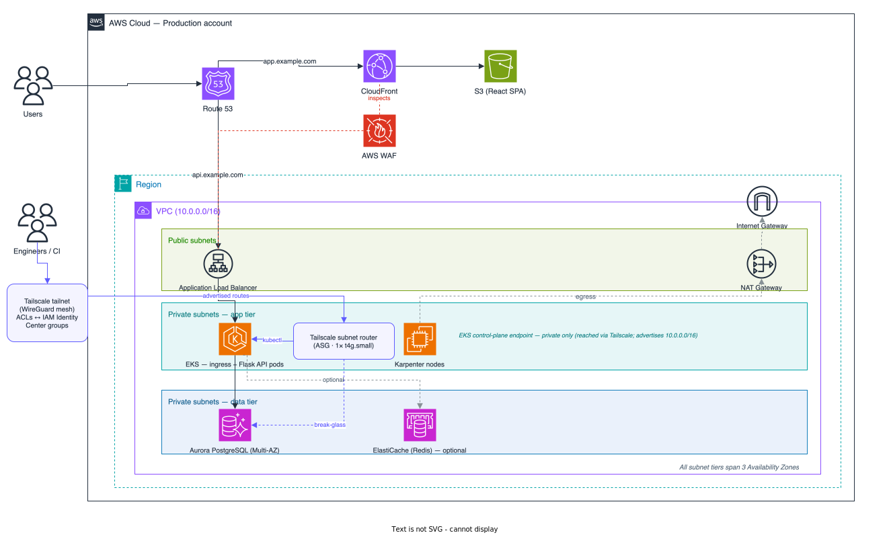

# Innovate Inc. — Cloud Architecture

## Overview

Innovate Inc. is an early-stage startup running a web application that handles sensitive user data. The application is a single-page React frontend backed by a Python/Flask REST API, with PostgreSQL as the system of record. Today the load is modest (a few hundred users per day), but the business plans for rapid growth toward millions of users, with continuous delivery from day one.

This document proposes a cloud architecture on **AWS** that is cheap and simple to run at launch but scales without a rewrite. The application runs on **Amazon EKS** (managed Kubernetes), using managed services wherever they save the team operational work. The data is **user PII**, so the design aims for a **SOC 2 / GDPR**-compatible posture from the start: isolation, encryption, least privilege, and audit logging are built in, not bolted on later.

**Why AWS.** All three options below pointed to AWS: mature multi-account governance (AWS Organizations, Control Tower, SCPs) that lets us start lean and tighten as we scale; first-class managed Kubernetes and Postgres (EKS, Aurora); and broad compliance coverage relevant to sensitive data. It also aligns the architecture with the EKS-based infrastructure delivered in the `terraform/` part of this repository.

## Architecture at a glance

CloudFront and S3 serve the React SPA; the API goes through an ALB to an in-cluster ingress controller. Pods run on Karpenter-managed Graviton/Spot nodes and talk to Aurora PostgreSQL in a private data tier. The sections below cover each layer.

## Component documents

| # | Document | Covers |
| - | -------- | ------ |
| 1 | [Cloud Environment Structure](01-cloud-environment.md) | AWS Organization, accounts/OUs, guardrails, cost governance |
| 2 | [Network Design](02-network-design.md) | VPC layout, subnet tiers, edge routing, network security, zero-trust access |
| 3 | [Compute Platform](03-compute-platform.md) | EKS, Karpenter (Graviton/Spot), scaling, containerization, GitOps delivery |
| 4 | [Database](04-database.md) | Aurora/RDS/CloudNativePG per environment, HA, backups, DR |
| 5 | [Observability & Operations](05-observability.md) | Metrics/logs/traces, SLOs, alerting, DR game days |

## Guiding principles

The design follows the [AWS Well-Architected Framework](https://aws.amazon.com/architecture/well-architected/) and these working rules:

- **Managed-first.** Use managed services over self-hosted ones so the team works on the product, not on running infrastructure.
- **Lean now, scalable later.** Start with the smallest footprint that's still *correct* for sensitive data, and make every Phase 1 choice a step toward the target state, not a dead end.
- **Security is not deferred.** The hardening that's painful to retrofit — production account isolation, least-privilege access, org-wide audit logging — ships in Phase 1; the rest is added as the company grows.
- **Decisions are explicit.** Every trade-off we accept is written down.

Each component document is structured the same way, so the evolutionary path is always visible:

| Subsection      | What it answers                                              |
| --------------- | ------------------------------------------------------------ |
| **Phase 1**     | What we build at launch — minimal, cost-efficient, correct.  |
| **Target state**| Where it grows as traffic and compliance needs increase.     |
| **Trade-offs**  | What we consciously gave up, and how Phase 1 stays migratable.|

## Key decisions

| Area          | Decision                                                                                          |
| ------------- | ------------------------------------------------------------------------------------------------- |
| Cloud         | **AWS**, single provider, standardizing on its managed services                                   |
| Accounts      | **5 accounts** (management, shared services, prod, staging, dev) under Organizations + OUs         |
| Network       | **Per-environment VPC**, 3 AZs, three-tier subnets; **private-only EKS endpoint**                  |
| Access        | **Tailscale** zero-trust mesh (SSM-bastion fallback)                                               |
| Compute       | **EKS per environment**; **Karpenter on Fargate**; Graviton + Spot via a single NodePool           |
| Delivery      | Multi-arch images → **ECR (shared)** → **Argo CD GitOps**; CI authenticates via **OIDC**           |
| Database      | **Aurora PostgreSQL** (prod Multi-AZ), tiered per env, **RDS Proxy**; CloudNativePG for ephemeral  |
| Observability | Self-hosted **VictoriaMetrics + VictoriaLogs + VictoriaTraces** (vm-operator, GitOps) + **Grafana OSS**; **OpenTelemetry** tracing; **SLOs** and alerts as code |
| Security      | Org-wide CloudTrail/Config/GuardDuty, **KMS CMK**, Secrets Manager, WAF, encryption in transit     |
| Cost          | Mandatory tagging, **AWS Budgets** + anomaly detection, consolidated billing                       |

## Global trade-offs

These apply to the architecture as a whole; each component document carries its own finer-grained table.

| Theme                                | What we accept                                                                                          |
| ------------------------------------ | ------------------------------------------------------------------------------------------------------- |
| **AWS over multi-cloud**             | Provider lock-in, in exchange for managed depth and one operating model. *Mitigated:* Kubernetes, OpenTelemetry, and Postgres keep the workload portable. |
| **Managed-first over self-hosted**   | Less low-level control and per-service cost, for far less operational toil — the right call for a small team. *Exception:* observability runs self-hosted on the VictoriaMetrics stack, where its cost/efficiency outweighs the managed convenience. |
| **Lean Phase 1, scalable target**    | Some target-state capabilities (mesh, multi-region, Global Database) are deferred. *Mitigated:* every deferral is **additive** — none requires a rebuild. |
| **Cost-vs-resilience tiering**       | Lower environments are not prod-identical. *Mitigated:* prod gets full HA; staging keeps engine-parity; ephemeral is disposable. |
| **Simplicity over completeness**     | Single NodePool, one region, edge-only TLS at first. *Mitigated:* each is a configuration change, not a re-architecture. |

The common thread: **Phase 1 is a strict subset of the target state.** The platform grows by turning configuration knobs — more accounts, more replicas, canaries, a second region — never by re-platforming.
